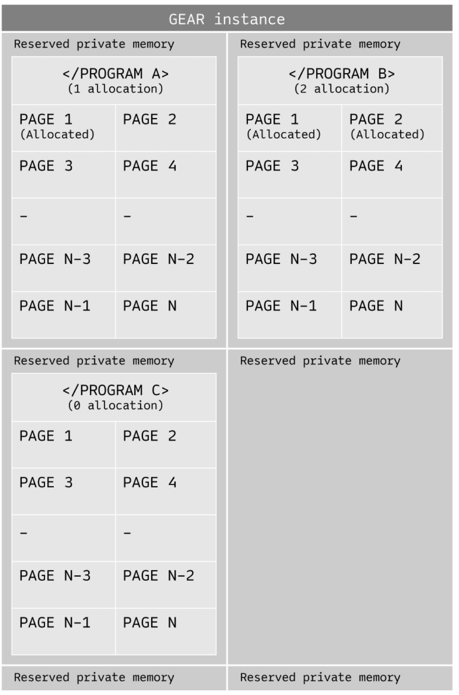
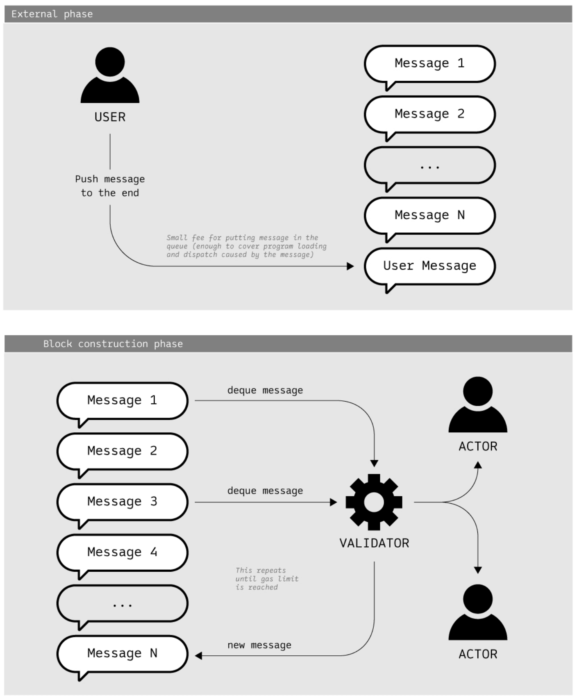
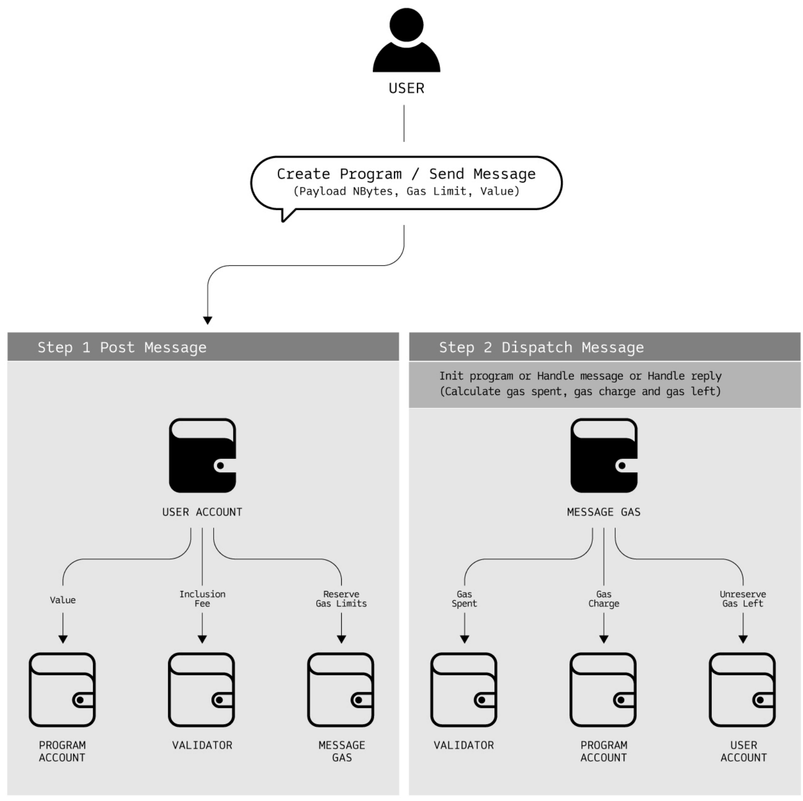
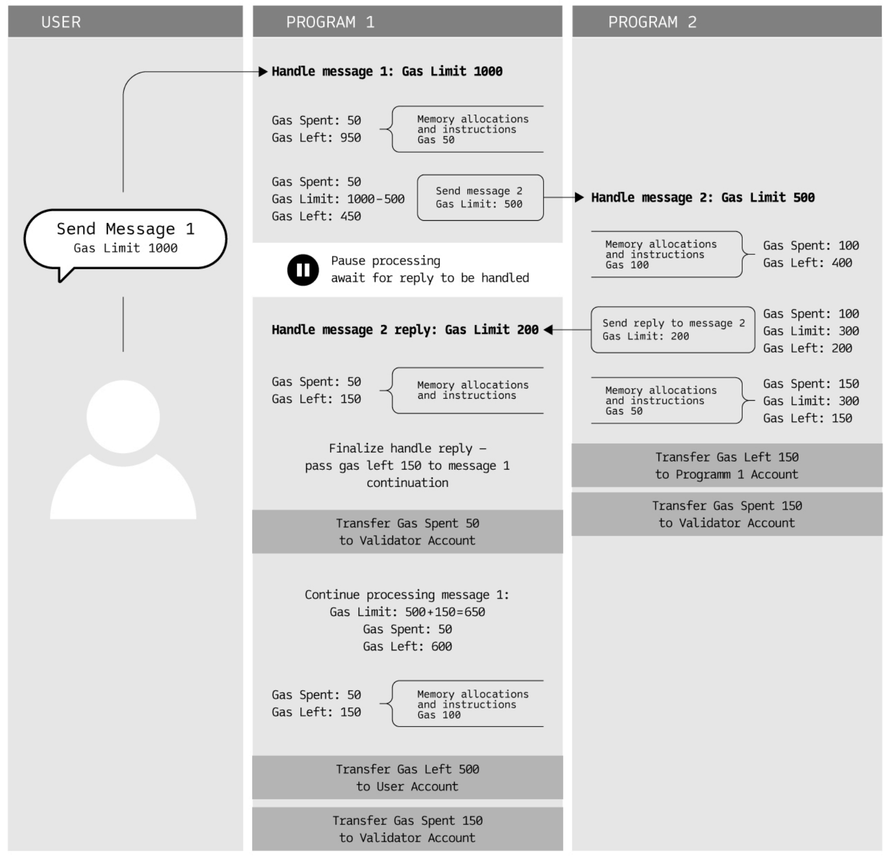
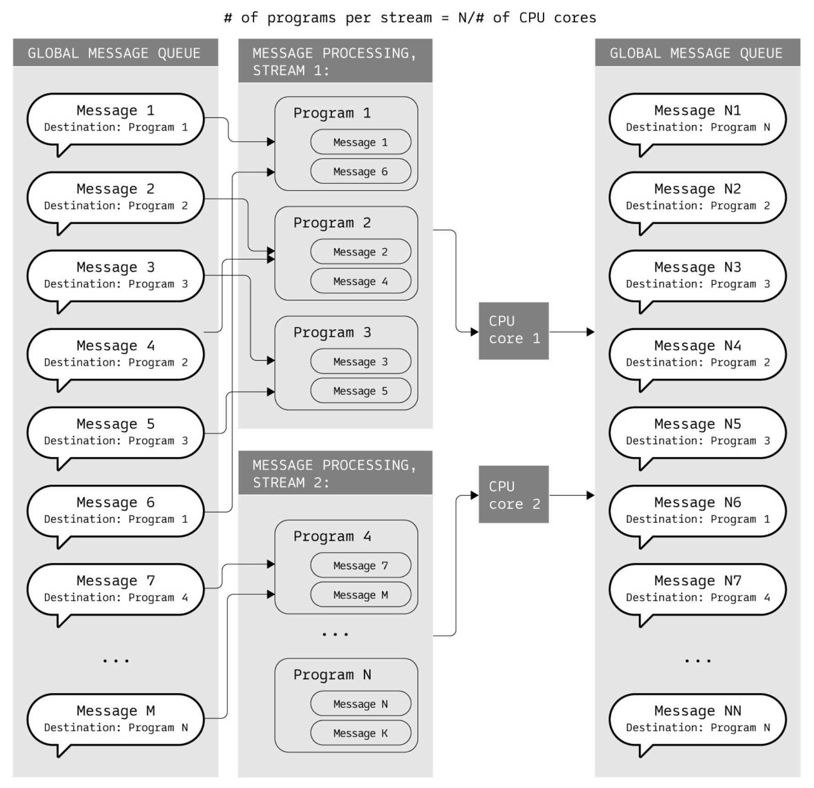
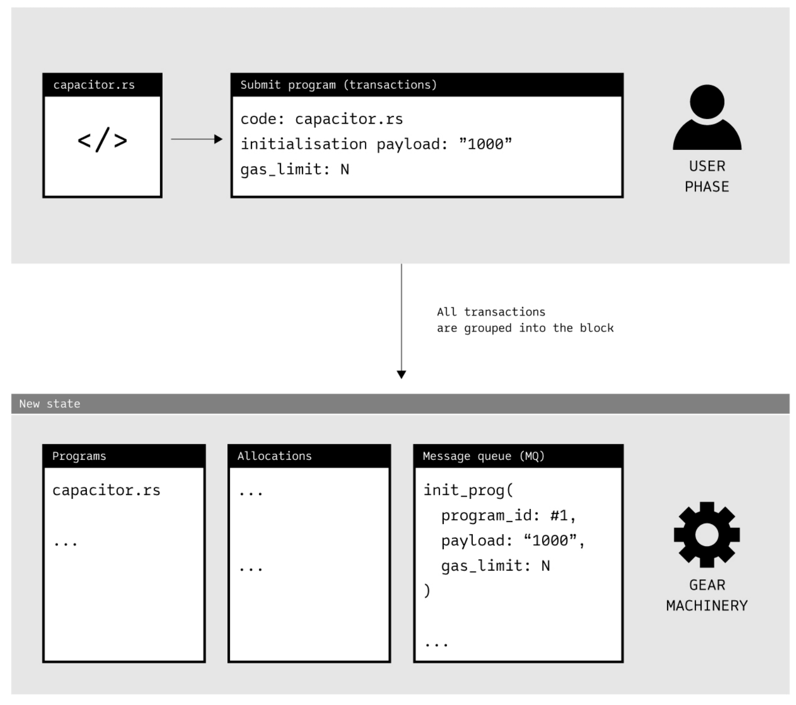
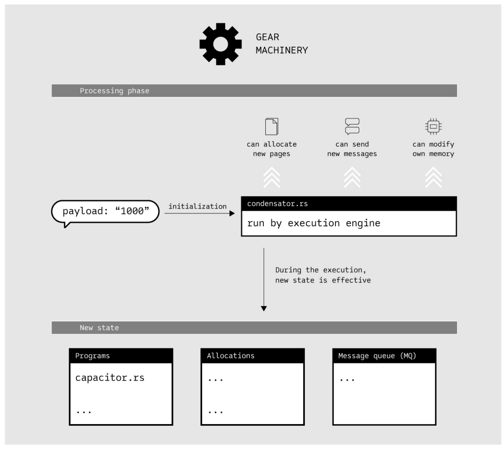
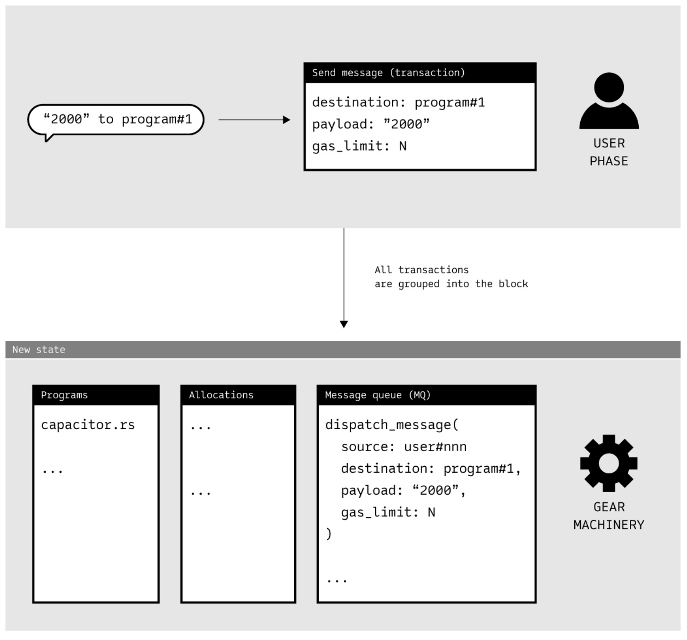
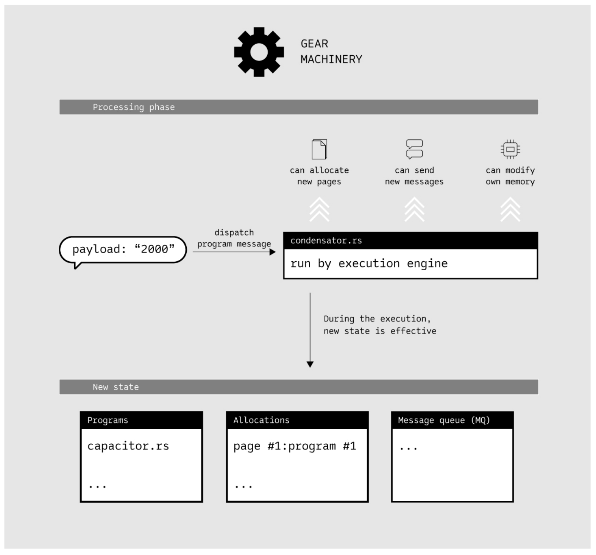

# Gear 技术

## 摘要

本文介绍了 Gear，作为一种新的 Polkadot/Kusama 平行链，在运行非信任代码时的技术。

Gear 为 Polkadot/Kusama 平行链和独立桥接区块链提供引擎。Gear 允许运行由许多流行语言（例如 C/C++、Rust 等）编译的 WebAssembly 程序（智能合约）。

Gear 智能合约架构利用 Actor 模型的优势，为 Immutable 提供持久内存，并确保区块链 API 的界面极简、符合直觉且功能完备。

## 1. 概述

第（2）章概述了 Substrate 区块链框架。

第（3）章概述了 Polkadot 网络和 Gear 在其中的作用。

第（4）章介绍了 Gear 网络状态的特征和组成部分。

第（5）章详细介绍了 Gear 网络状态的演变。

第（6）章介绍了余额转移、Gas 经济和 DoS 保护。

第（7）章介绍了在 Gear 网络状态下，使用 Actor 模型进行跨进程（或跨合约）通信，以及它带来的分散式计算。

第（8）章介绍了使用 async/await 模式进行异步通信。

第（9）章介绍了 Gear 引擎如何保证消息并行处理和硬件资源的高效利用。

第（10）章讨论了 Gear 如何处理用户与程序交互的输入的典型场景。

第（11）章介绍了在 Gear 网络中使用的 WebAssembly 虚拟机（VM），以及 VM 实现时的显著特性。

第（12）章介绍了有效使用 Gear 的一些案例

## 2. Substrate 框架

Substrate 区块链框架是 Polkadot 网络的重要组成部分。它允许每个创建新区块链的团队不用浪费精力从头开始实施网络和共识代码。

Substrate 涵盖了复制（网络层）和容错（共识机制）。这些层面的技术描述超出了本文的范围。参见 Substrate 文档。

Gear 在底层使用 Substrate 框架。它能满足企业级分散项目最需要的要求，即：容错、可复制、通证化、不可变性、数据安全性和发布就绪的跨平台持久内存数据库。

Gear 本身是作为自定义 Substrate runtime 实现的。它还引入了高级本机扩展（通过主机功能）以提高性能。

使用 Substrate 可以快速连接 Gear 实例，作为平行链/平行线程，进入 Polkadot/Kusama 网络。

## 3. Polkadot 网络

Polkadot 是下一代区块链协议，旨在联合多个专门构建的区块链，使它们能够大规模无缝运行。

Polkadot 架构中有几个组件，分别是：Relay Chain，Parachains 和 Bridges。

### Relay Chain

Relay Chain 是 Polkadot 的核心，负责网络的安全性、共识和跨链互操作性。

### Parachains

Parachains 是主权区块链，可以拥有自己的通证并针对特定用例优化其功能。Parachains 必须连接到 Relay Chain 以确保与其他网络的互操作性。因此，Parachains 可以随用随付或租用一个插槽以实现连续连接。

### Bridges

Bridges 是一种特殊的连接，允许 Polkadot 生态系统连接到外部网络并与之通信，如以太坊、比特币等。这种连接允许将通证或任意数据从一个区块链转移到另一个区块链。

### Polkadot 通信模型和 Gear 在其中的作用

Polkadot 网络的关键是它能够在链之间路由任意消息。使用此消息非常简单：协商两个平行链之间的通道并通过它发送异步消息。

Polkadot 的 Relay Chain 和 Gear 最终会使用同一种语言（异步消息）。基于 Gear 的项目可以将他们的解决方案无缝集成到整个 Polkadot/Kusama 生态系统中。

异步消息架构使 Gear 成为一个有效且易于使用的 Polkadot 网络平行链：

1. 用户将程序部署到 Gear 网络。
2. 为常用的 Parachains 或 Bridges 建立了单独的渠道（可能有很多且相互竞争）。
3. 整个 Gear 平行链通过它们进行通信。

这种架构允许驱动网络在状态之间的转换并且非常适合整个网络

## 4. 网络状态

与任何区块链系统一样，Gear 保持分布式状态。编译为 WebAssembly 的 Runtime 成为区块链存储状态的一部分。

Gear 确保了其中一项定义特性——无分叉 Runtime 升级。如果使用 finality gadget，也能保证最终网络状态完成。

存储状态组件：

- 程序和内存（包括程序代码和私有内存）
- 消息队列（网络的全局消息队列）
- 账户（网络账户及其余额）

### 程序

程序是 Gear 实例状态中的一等公民。

程序代码存储为不可变的 Wasm blob。每个程序都有固定数量的内存，在消息处理之间保持不变（所谓的静态区域）。

程序可以从 Gear 实例提供的内存池中分配更多内存。一个特定的程序只能在专门分配给它的内存中读写。

### 内存

Gear 实例为每个程序保存单独的内存空间，并且保证它的持久性。一个程序只能在自己的内存空间内读写，不能访问其他程序的内存空间。单独的内存空间是在程序初始化时为程序保留的，不需要额外的费用（包含在程序初始化费用中）。

程序可以以 64KB 的块为单位分配所需的内存量。每个内存块分配都需要费用。每个页面（64KB）单独存储在分布式数据库后端，但在运行时，Gear 节点构建连续运行时内存并允许程序在其上运行而无需重新加载。



### 消息队列

Gear 实例保存一个全局消息队列。使用 Gear 节点，用户可以用一条或多条消息发送事务给特定的程序。这将填充消息队列。在块构造过程中，消息被退出队列并路由到特定的程序。

### 账户

对于公共网络，防止 DOS 攻击需要付费交易处理。Gear 提供了一个余额模块，允许存储用户和程序余额，并支付交易费用。

一般来说，一个特定的 Gear 网络实例可以定义为同时含有权限的和无权限的公共区块链。在许可的场景中，不需要余额模块。

## 5. 状态转换

每个系统都遵循系统状态演化所依据的规则。在网络处理新输入数据时，根据状态转换规则对状态进行超前处理。这个输入数据被封装在称为事务的原子信息块中。

Gear 节点维护和同步包含了所有的新交易的交易池。当任何节点(验证者或非验证者)接收到交易时，该节点将交易传播到所有连接的节点。要进一步了解交易池是如何操作的，参见 Substrate 文档。

当 Gear 验证者节点开始生成新块时，池中的一些（或全部）交易合并到一个区块中，并且网络通过这个块进行状态转换。在上一个区块中没有被采取的交易将保留在池中，直到下一个区块产生。

Gear 支持以下类型的交易：

1. 创建程序（用户上传新程序-智能合约）

2. 发送消息（程序填满消息队列）

3. 消息出列（验证者（区块生产者）出列多条消息，运行相关程序）

4. 余额转移（Gear 引擎执行用户-程序-验证者余额转账）

在块构建/导入时间的保留空间中进行消息处理。保证消息处理将在每个块中执行，并且至少以当前实例设置确定的某个特定速率执行。

### 创建程序

Gear 网络的指定机构（或任何公开实施的用户）可以提出保存到状态的新程序。对于公共网络，还提供了与程序相关联的余额。这个新的余额构成了初始余额（现有存款）。

### 发送消息

最终用户与程序交互，并因此向 Gear 网络发送消息。发送到 Gear 网络的消息填满了全局消息队列。这个队列可以被看作是一个运行时驱动的事务队列，但保证接受到它的任何消息最终都会被处理。将消息放入队列不是免费的，因此可以保证发送消息。

### 消息出列

验证者可以选择在轮到他们产生下一个区块时出列哪些消息。它消除了每个特定验证者维护完整内存状态的需要。出列仅发生在每个块的末尾。在出队期间，可以生成新消息。它们也可以在这个阶段被处理，但也可以留在队列中等待下一个块（和另一个验证者）。

### 余额转移

定期余额转移在 Substrate 余额模块内执行。详情参见下一章。

### 消息、块和事件生命周期

下图说明了 Gear 机制的永恒生命周期。正如通信的 Actor 模型所规定的那样，没有什么是共享的，只有消息。目标为“system”的消息最终会出现在事件日志中，以便在用户空间中进行检查。



## 6. 余额转移和 Gas 经济

定期余额转移在 Substrate 余额模块内进行。余额在用户、程序和验证者帐户之间转移。

除了定期的余额转移，Gear 网络还定义了用于奖励验证者节点工作的余额转移，并允许保护网络免受 DoS 攻击。

Gear 节点在消息处理过程中收取费用。下面详细描述消息处理算法。

Gear 网络内的所有交互都是通过消息传递完成的。Gear 中的消息具有通用接口，含以下参数：

- source account,
- target account,
- payload,
- gas_limit
- value

Gear 网络中使用了五种类型的消息：

1. 来自用户的特殊消息，用于将新程序上传到网络。Payload 必须包含程序本身的 Wasm 文件。不得指定 target account——它将作为处理消息发布的一部分创建。
2. 从用户到程序
3. 从程序到程序
4. 从程序到用户
5. 从用户到用户

发送消息函数的最后一个参数是要转移到 target account 的 value。在初始程序上传的特殊消息中，value 将转移到为程序新创建的帐户的余额中。

消息处理包括两个步骤：



### 第一步

Gear 网络尝试将消息发布到队列中，旨在验证 source account 有足够的余额来支付 value 和 gas_limit 的发送以及支付小额处理费用，该费用与有效负载大小呈线性关系（这是 Substrate 框架的标准包含费用，详见 Substrate 文档）。

验证后，Gear 网络的区块生产者将消息发布到区块中，将 value 转移到 target account，将小额处理费用转移到验证者帐户，并在 source account 上保留等于 gas_limit 的费用。

### 第二部

程序消息由网络通过以下方式分发：

上传程序时，用户指定 gas_limit 和可选的 value 转到程序帐户。gas_limit 是程序初始化上的最大花费。

当一个程序被 Gear 节点初始化时，每个内存页面分配和每个 cpu 指令都会消耗 gas 费用。它增加内部计数器 - gas_spent。

Gear 节点检查 gas_spent 的每个增量的 value 低于初始化消息中指定的 gas_limit，如果超过，则停止程序执行。通过这种方式 gas_limit 可以保障用户余额，因此没有程序会消耗超过用户预期的。

还可选程序尝试为自己的余额保留额外的 gas，以便将来或在初始化期间向其他程序发送消息。可以通过使用特殊指令 gas_charge 来完成。指定后，Gear 节点会自动检查 gas_spent 加 gas_charge 是否低于消息中指定的 gas_limit。增加程序余额的另一种方法是使用初始化消息的最后一个参数明确指定转移 value 到其余额。

程序初始化后，gas_spent 会从用户账户中扣除到验证者的账户中，gas_charge 从用户账户中扣除到程序账户中。

gas_limit 和 gas_spent 加 gas_charge 的区别是 gas_left 并且它的 value 在 source account 上是未保留的。

Gas 费用是线性的——每分配 64KB 内存页面 64000 gas 和检测 Wasm 指令 1000 gas。

对于目标是程序的标准消息，以上所有 gas 消耗规则均适用，以及通过增加 gas_spent 值收取额外的内存租金。此内存租用费用类似于内存分配费用，但价格低于初始分配的费用-每个已分配页面 1000 gas。由于节点必须从/向网络状态加载/保存程序内存，因此收取内存租金。

下图显示了更详细的余额转账示例：



并非所有传入消息都可以在一个周期内处理并出现在单个块中。会发生这种情况，所有消息产生所需的 gas 超过块 gas 限制。在这种情况下，消息可以出现在下一个块中（考虑到更多新消息即将到来）。

Gear 节点选择哪些交易与消息，将最终放入队列中。来自具有最高费用的交易的消息首先被获取。在这种情况下，来自费用最低的交易的消息可能会延迟，甚至永远不会进入处理队列。偏离标准的交易处理算法可能会导致不利的经济情况。

## 7. Actor 模型通信

并发系统的主要挑战之一是并发控制。它定义了不同程序间正确的通信顺序，并协调对共享资源的访问。潜在的问题包括竞争条件、死锁和资源匮乏。

并发计算系统可以分为两类：

共享内存通信——并发程序通过更改共享内存位置的内容进行通信。
消息传递通信——通过消息交换进行并发程序通信。消息传递并发比共享内存并发更容易理解。它通常被认为是一种更加鲁棒性的并发编程形式。

通常，消息传递并发性比共享内存具有更好的性能特征。在消息传递系统中，每个进程的内存开销和任务切换开销较低。

有很多数学理论来诠释消息传递系统，包括 Actor 模型。

对于跨进程通信，Gear 使用 Actor 模型方法。Actor 模型越来越受欢迎，它已被用于许多新的编程语言，通常作为一流的语言概念。Actor 模型的原则是程序从不共享任何状态，而只是在彼此之间交换消息。

而在一个普通的 Actor 模型中，消息顺序没有保证，Gear 做了一些额外的保证，以保留两个特定程序之间的消息顺序。

使用 Actor 模型方法提供了一种在程序（智能合约）逻辑中实现基于 Actor 的并发性的方法。这可以利用各种语言构造进行异步编程（例如，Rust 中的 Futures 和 async-await）。

## 8. Async/await 支持

与分类不同，Actor 一次只允许一个任务访问它们的可变状态，这使得多个任务中的代码可以安全地与同一个 Actor 实例交互。

异步函数显着简化了并发管理，但它们不处理死锁或状态损坏的可能性。为避免死锁或状态损坏，异步函数应避免调用可能阻塞其线程的函数。为了实现它，他们使用了 await 表达式。

目前，在典型的智能合约代码中缺乏对 async/await 模式的正常支持，给智能合约开发者带来了很多问题。实际上，通过添加手工功能（在 Solidity 智能合约中），或多或少可以在智能合约程序流程中实现更好的控制。但是合约中的许多函数的问题在于，人们很容易混淆——哪个函数可以在合约生命周期的哪个阶段被调用。

Gear 本身为任何程序提供任意的 async/await 语法。它极大地简化了开发和测试，并减少了智能合约开发中出错的可能性。如果程序逻辑需要，Gear API 还允许通过不使用 await 表达式来使用同步消息。

## 9. 内存并行

每个程序的独立独立内存空间，允许了在 Gear 节点上并行化消息处理。并行处理流的数量等于 CPU 内核的数量。每个流处理用于定义的程序集的消息。它与从其他程序或从外部（用户的交易）发送的消息有关。

例如，给定一个包含靶向 100 个不同程序消息的消息队列，Gear 节点在配置了 2 个处理线程的网络上运行。Gear 引擎使用运行时定义的流数（等于典型验证器机器上的 CPU 核数），将目标程序总数除以流数，并为每个流创建一个消息池（每个流 50 个程序）。

程序被分发到不同的流，并且每条消息都出现在定义了其目标程序的流中。因此，寻址到特定程序的所有消息都出现在单个处理流中。

在每个循环中，一个目标程序可以有多个消息，一个流处理大量程序的消息。消息处理的结果是来自每个流的一组新消息添加到消息队列中，然后循环重复。

消息处理过程中产生的结果消息通常被发送到另一个地址（返回原点或下一个程序）。



## 10. 典型场景

让我们来看看在运行虚拟程序时 Gear 的作用机制。

Gear 允许任何编译为 WebAssembly 的通用语言程序运行，例如这个`capacitor.rs`：

```rust
static mut CHARGE: u32 = 0;

static mut LIMIT: u32 = 0;

static mut DISCHARGE_HISTORY: Vec<u32> = Vec::new();

#[no_mangle]
pub unsafe extern "C" fn handle() {
  let new_msg = String::from_utf8(msg::load()).expect("Invalid message: should be utf-8");
  let to_add = u32::from_str(&new_msg).expect("Invalid number");
  CHARGE += to_add;

  if CHARGE >= LIMIT {
    DISCHARGE_HISTORY.push(CHARGE);
    msg::send(0.into(), format!("Discharged: {}", CHARGE).as_bytes(), 1000000000);
    CHARGE = 0;
  }
}
```

完整示例，请参见我们的[测试箱](https://github.com/gear-tech/test-gear)。

这是一个简单的程序，对传入的消息“charge”，当“charge”总量超过初始化中提供的某个限度时“discharges”。

让我们来看看一系列图表，说明用户如何创建这样一个程序，然后与它交互：

1. 这就是程序的创建方式——用户只需发送带有程序和初始化参数的事务：



2. 然后 Gear 处理这个新输入：



3. 一旦创建，程序就可以接收消息。例如，用户可以向它发送 2000 的“charge”：



4. 然后 Gear 处理这个新输入：



## 11. 虚拟机 (WebAssembly)

Gear 在底层使用 WebAssembly（或 Wasm）。任何 Gear 程序都是 WebAssembly 格式。

WebAssembly 是一种用于部署程序的代码格式。在 Gear 中，任何智能合约都是一个 WebAssembly 程序。

WebAssembly 具有以下优点：

- 原生速度。 因为它转换为实际的硬件指令。
- 便携。它可以在任何实际硬件上运行。
- 安全。正确验证的 WebAssembly 程序不能离开沙盒（由规范保证）。

WebAssembly 是一项全球性的工业技术，其卓越的原因有很多：

- 它是在其领域的所有主要竞争对手之间合作设计和实施的。
- 它是与完整的数学、机器验证的形式化一起设计和发布的。

## 12. 适用性和案例

### 微/纳米服务

多年前，软件开发从单体架构转向微服务架构。解决与紧密耦合、互连代码相关的先前方法的复杂性。近年来，纳米服务已成为解决已知微服务复杂性的主流。

任何编译为 Wasm 的通用语言纳米服务功能都可以作为程序上传到 Gear。Gear 会在必要的时间范围内，执行代码来处理某个任务。Gear 根据需要处理的任务数量提供自动无缝可扩展性。您只需为函数消耗的资源付费。

在与 Gear 中的其他纳米服务交互时，您可以立即获得适用的架构。只需专注于对您重要的代码片段，Gear 会处理其余的部分。
